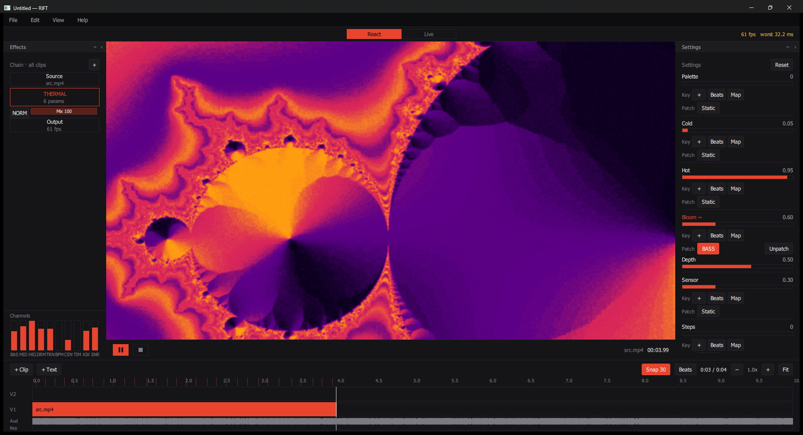
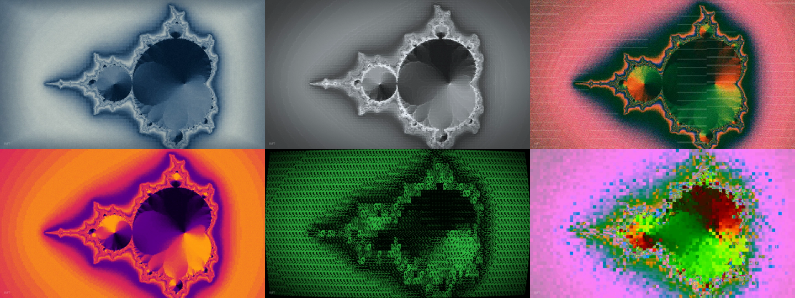
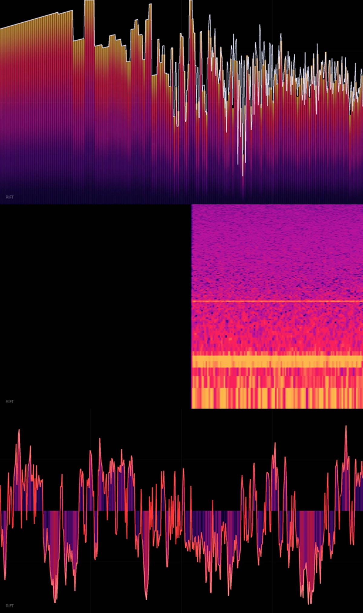

# RIFT

**Sound into picture.**

Audio-reactive visuals for Windows - load a track, stack footage, drive any
setting from the music, export up to 4K. Or plug in a controller and perform it.

[Download](#download) · [Guide](GUIDE.md) · [What's new](CHANGELOG.md)

---

## What it is

Every tool for this is either a toy or a second job. The simple ones make one
look and stop. The serious ones expect you to already know what a feedback
buffer is.

RIFT is the middle. Nothing hidden behind jargon, nothing dumbed down, and you
should get somewhere good on the first evening - without giving up the ceiling
later.

---

## Screenshots

*The app - effect chain on the left, settings on the right, timeline below.*

 

*Twenty-four effects, from print processes to codec damage.*

 

*Five audio instruments in one effect: waveform, spectrum, spectrogram,
stereometer, bands.*

---

## Download

Grab the latest **`RIFT-0.1.2-setup.exe`** from
[**Releases**](../../releases/latest), run it, and you're done. Everything the
app needs is inside - no Qt, no FFmpeg, no runtime to install separately.

**Requirements**

- Windows 10 or 11, 64-bit
- A GPU supporting Direct3D 11 (roughly anything from 2012 onward)

**Windows will warn you.** The app isn't code-signed yet, so you'll see
*"Windows protected your PC"*. Click **More info → Run anyway**. Some antivirus
may also flag a new unsigned program - that's reputation, not detection.

---

## What it does

**Bring in anything** - video, images, vectors, text. Multiple clips on stacked
lanes with blend modes, opacity and transform.

**Twenty-four effects**, chained in any order, each with a blend mode and mix
amount:

| | |
|---|---|
| **Pattern** | Ascii · Halftone · Dither · Risograph · Terminal |
| **Damage** | Glitch · Pixel sort · Datamosh |
| **Photographic** | Cyanotype · Thermal cam · Electron scan · Blur · Lens · Bloom |
| **Symmetry** | Kaleido · Mirror tile |
| **Motion** | Flow warp · Feedback · Slit scan |
| **Geometry** | Voronoi shatter · Dot field · Tunnel |
| **Audio** | Oscilloscope - waveform, spectrum, spectrogram, stereometer, bands |
| **Finishing** | Post FX - vignette, grain, scanlines, dither, glass · Colour grade |

**Drive any setting from the music.** Ten channels - bass, mids, highs, drums,
transients, kick, snare, tempo, brightness, time - patched to any slider with an
adjustable depth. **No pre-analysis step:** load a `.wav` or `.mp3` and it works.

**Keyframe anything**, with linear, ease or step interpolation - and keyframes
stack *on top of* audio reactivity, so a parameter can be both automated and
reactive.

**Beat detection** with snap-to-beat clip dragging, so cuts land on the music.

**Two modes.** *React* builds a piece and exports it. *Live* performs it, mapped
to a MIDI controller - with a drawn layout for the Arturia MiniLab mk II, plus
OSC.

**Export** to 1080p, 2K or 4K, several aspect ratios, four quality levels
including ProRes. The app stays usable while it renders, and a queue batches
jobs.

Full walkthrough in the [**guide**](GUIDE.md).

---

## Known limitations

Honest list, so testers aren't surprised:

- **Not code-signed** - SmartScreen will warn on first run.
- **Windows only.** The renderer is Direct3D 11; there's no software fallback.
- **The Oscilloscope is the most expensive effect**, especially Stereometer.
  On a heavy chain it can drop the frame rate. The readout at the top right
  shows the worst recent frame time - amber means it's missing 60 fps.
- **Datamosh is an approximation.** True datamosh needs the previously decoded
  frame; this reproduces the macroblock grid, drift and bloom, but a still image
  won't smear into the next shot. Feedback and Slit scan now do have access to
  the previous frame, so this one is next in line to use it.
- **Slit scan builds its history as it plays.** It accumulates from the
  previous frame rather than holding a buffer of past frames, so it needs about
  two seconds of run-up and cannot be scrubbed. Give it a lead-in rather than
  cutting on the first frame.
- **Tunnel is a raymarcher.** Around 48 steps per pixel. It holds 60 fps here,
  but it is the second most expensive effect after the Oscilloscope.
- **Docks swap sides rather than float freely.** Free-floating panels aren't in
  yet.

---

## Feedback

Bug reports and impressions are the point of this build. Useful to include:

1. What you did, and what happened instead
2. Your GPU, and Windows version
3. The frame rate / worst-frame figure at the top right, if it's a speed problem

---

## Credits

Built by **Revanth Rangisetti**. Designed by a human, written with AI.

Wordmark set in *Yessie's brother* by Adele Markova, SUVA Type Foundry.
Rendering with Qt RHI (Direct3D 11) · decode and encode with FFmpeg · audio with
miniaudio and pffft. Full notices ship with the application.
