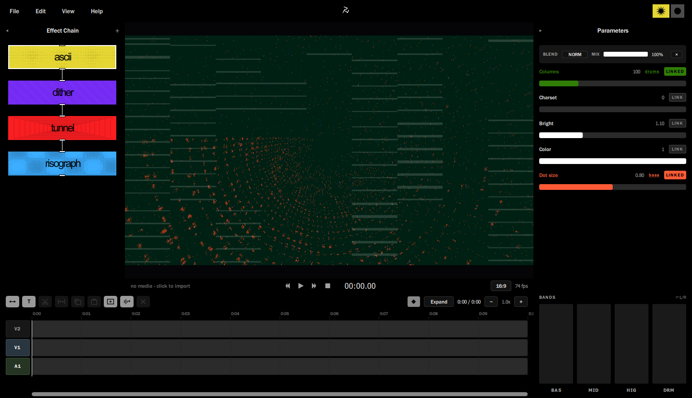

# RIFT

> **Real-time audio-reactive visual engine and GPU effect processor.**



RIFT turns music into picture. It runs video footage, images, text, and procedural generators through an audio-driven GPU effect chain, rendering in real time for live performance or exporting frame-accurate videos up to 4K.

---

## Features

- **Real-Time Audio Reactivity**:
  - Live loopback audio capture and offline audio stem analysis.
  - Frequency band separation: Sub-Bass, Bass, Mids, Highs, Transients, Centroid, Kick/Snare detection.
  - Parameter modulation patch bay: map any shader uniform to audio channels with customizable attack/decay smoothing.
- **Minimeters-Style Visualizers**:
  - **Oscilloscope**: Sub-sample zero-crossing hysteresis trigger; sharp waveform rendering with dual-pass glow.
  - **Spectrum Analyzer**: Logarithmic 20 Hz – 20 kHz fluid response with frame-rate independent dB-domain gravity decay.
  - **Spectrogram**: 2D scrolling waterfall heatmap with 256-entry colormapping (-90 dB to 0 dB).
  - **Lissajous Vectorscope**: 45° rotated mid/side stereo radar projection with persistence trails.
- **High-Performance GPU Pipeline**:
  - Direct3D 11 backend via Qt RHI (QRhi) with dynamic per-pass uniform buffer ring buffering.
  - 30+ GLSL/QSB shaders: Tunnel, Feedback, Kaleidoscope, Datamosh, Glitch, Ascii, Bloom, Blur, Color Grade, etc.
  - Multi-lane video/audio timeline with clip trimming, lane compositing, and layer blending.
- **Offline Export & Batch Queue**:
  - Hardware-accelerated encoding via NVENC (H.264/HEVC) and ProRes.
  - Frame-accurate, deterministic offline export where audio reactivity is sampled at exact timestamps (`N / fps`).
  - Batch render queue with progress tracking and job cancellation.
- **Brutalist Technical Interface**:
  - Clean, high-density UI built in Qt Quick/QML with 0px corner radii, 1px hairlines, and fixed channel colors.
  - Responsive project aspect ratio canvas scaling (16:9, 9:16, 1:1, 4:3, 21:9) and on-screen clip transform controls.

---

## Tech Stack

| Component | Technology |
|---|---|
| Core Engine | C++20 |
| Graphics API | Qt RHI (Direct3D 11 on Windows) |
| Shaders | GLSL compiled to QSB (SPIR-V / HLSL bytecode) |
| Media Decoding | FFmpeg (libavcodec, libavformat, libswresample, libswscale) |
| Audio System | miniaudio + pffft (C++ FFT band analysis) |
| User Interface | Qt 6 Quick / QML |
| Build System | CMake 3.24+ / MSVC 2022 |

---

## Building from Source

### Prerequisites
1. **Windows 10/11 (x64)**
2. **Visual Studio 2022** with C++ Desktop Development workload.
3. **Qt 6.7+** (with Qt Quick, QML, and QRhi).
4. **CMake 3.24+**.
5. **FFmpeg shared libraries / headers** (LGPL or GPL build).

### Build Instructions

```powershell
# Clone the repository
git clone https://github.com/your-username/RIFT_engine.git
cd RIFT_engine

# Configure CMake with Release configuration
cmake -B build-release -DCMAKE_BUILD_TYPE=Release

# Build rift_shell executable
cmake --build build-release --config Release --target rift_shell
```

The compiled binary and staged shaders/assets will be generated in `build-release/Release/`.

---

## CLI Usage & Headless Export

RIFT can be launched as a desktop UI or run headlessly for batch exports:

```powershell
# Open with media and audio preloaded
./rift_shell.exe --clip "path/to/video.mp4" --audio "path/to/track.wav" --chain "tunnel,bloom"

# Batch render a 3-second export directly from CLI
./rift_shell.exe --clip "input.mp4" --audio "track.wav" --chain "oscilloscope" --play --export "output.mp4"
```

---

## License

RIFT is licensed under the MIT License. See [LICENSE](LICENSE) for details.
Third-party notices and licenses are documented in [THIRD-PARTY-NOTICES.md](THIRD-PARTY-NOTICES.md).
