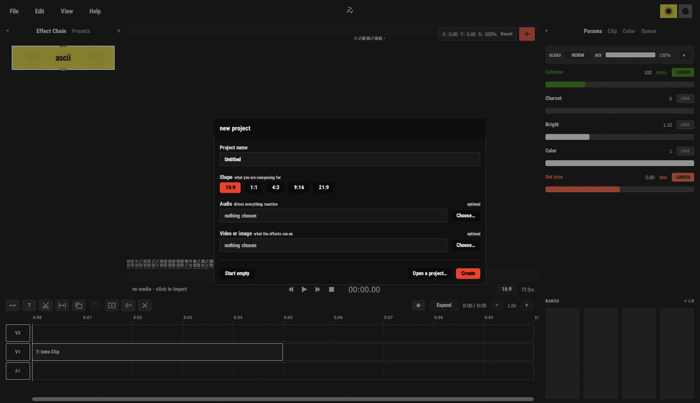
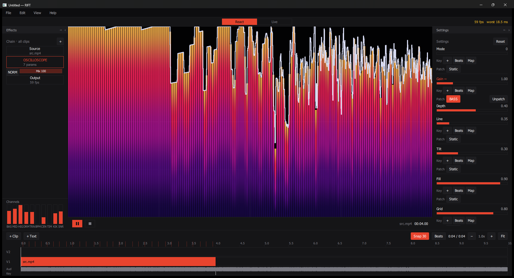
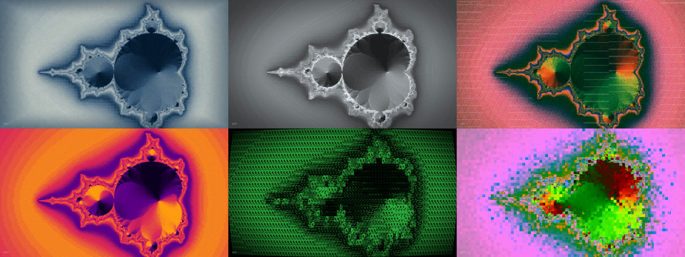

# RIFT

> **Real-time audio-reactive visual engine and GPU effect processor.**


RIFT turns music into picture. It runs video footage, images, text layers, and procedural generators through an audio-driven GPU effect chain, rendering in real time for live performance or exporting frame-accurate videos up to 4K.

---

## Downloads

Download the latest installer from the [Releases](https://github.com/rogueexxxx-del/RIFT/releases) page:

- **[RIFT-1.0.0-setup.exe](https://github.com/rogueexxxx-del/RIFT/releases)** (Windows 10/11 x64 installer)
- Portable ZIP releases are also available in Releases.

---

## Visual Showcase

### Multi-Lane Timeline & Non-Destructive Editing
Split clips, independent per-clip GPU shader chains, razor cutting, and audio sync.


### Real-Time Audio Visualizer Suite
Oscilloscope with zero-crossing sync, 4096-bin log FFT spectrum, and Minimeters-grade audio taps.


### GPU Shader Chain & Procedural FX
Over 30 modular shaders: Datamosh, Glitch, Ascii, Feedback Loops, Voronoi, Bloom, and Color Grading.


---

## Features

- **Real-Time Audio Reactivity**:
  - Live system loopback capture and offline audio stem analysis.
  - Multi-band frequency separation: Sub-Bass, Bass, Mids, Highs, Transients, Centroid, and Onset Beat detection.
  - Interactive modulation patch bay: map any shader uniform to audio channels with customizable smoothing attack/decay.
- **Minimeters-Style Visualizers**:
  - **Oscilloscope**: Sub-sample zero-crossing hysteresis trigger with sharp vector lines and dual-pass glow.
  - **Spectrum Analyzer**: Logarithmic 20 Hz – 20 kHz fluid response with frame-rate independent dB-domain gravity decay.
  - **Spectrogram**: 2D scrolling waterfall heatmap with 256-entry colormapping (-90 dB to 0 dB).
  - **Lissajous Vectorscope**: 45° rotated mid/side stereo radar projection with persistence trails.
- **High-Performance GPU Pipeline**:
  - Direct3D 11 backend via Qt RHI (QRhi) with dynamic per-pass uniform buffer ring buffering.
  - 30+ modular GLSL/QSB shaders: Tunnel, Feedback, Kaleidoscope, Datamosh, Glitch, Ascii, Bloom, Color Grade, etc.
  - Multi-lane video/audio timeline with clip trimming, lane compositing, and layer blending.
- **Per-Clip & Master Effect Architecture**:
  - Split and chop videos with the Razor tool (`C`); each clip maintains an independent effect chain without altering master effects.
  - Right-click node context menu: Change/Replace Effect, Duplicate, Reset Parameters, and Delete.
  - Transport freeze: Shaders, feedback loops, and audio taps freeze instantly on pause.
- **Offline Export & Batch Queue**:
  - Frame-accurate, deterministic offline export where audio reactivity is sampled at exact timestamps (`N / fps`).
  - Watermark toggle: Enable or remove RIFT watermark directly in the export dialog.
  - Batch render queue with progress tracking and job cancellation.
- **Modern Dark UI**:
  - Sleek interface built in Qt Quick/QML with high-density controls, WCAG AA contrast compliance, and dark aesthetic.

---

## Keyboard Shortcuts

| Shortcut | Action |
|---|---|
| <kbd>Space</kbd> | Play / Pause transport |
| <kbd>C</kbd> | Toggle Razor Tool (Cut clips at playhead or mouse click) |
| <kbd>Esc</kbd> | Return to Selection Tool |
| <kbd>V</kbd> | Selection Tool |
| <kbd>T</kbd> | Add Text Clip |
| <kbd>K</kbd> | Insert Keyframe at Playhead |
| <kbd>Ctrl</kbd> + <kbd>E</kbd> | Export Video Dialog |
| <kbd>Ctrl</kbd> + <kbd>S</kbd> | Save Project (`.rt`) |
| <kbd>Ctrl</kbd> + <kbd>O</kbd> | Open Project |
| <kbd>Ctrl</kbd> + <kbd>Z</kbd> / <kbd>Ctrl</kbd> + <kbd>Y</kbd> | Undo / Redo |

---

## Tech Stack

| Component | Technology |
|---|---|
| Core Engine | C++20 |
| Graphics API | Qt RHI (Direct3D 11 on Windows) |
| Shaders | GLSL compiled to QSB (SPIR-V / HLSL bytecode) |
| Media Decoding | FFmpeg (libavcodec, libavformat, libswresample, libswscale) |
| Audio System | miniaudio + pffft (C++ FFT band analysis) |
| User Interface | Qt 6 Quick / QML |
| Build System | CMake 3.24+ / MSVC 2022 |

---

## Building from Source

### Prerequisites
1. **Windows 10 / 11 (x64)**
2. **Visual Studio 2022** with C++ Desktop Development workload.
3. **Qt 6.7+** (with Qt Quick, QML, and QRhi via vcpkg or Qt Online Installer).
4. **CMake 3.24+**.
5. **FFmpeg shared libraries / headers** (LGPL or GPL build).

### Step-by-Step Setup

```powershell
# 1. Clone the repository
git clone https://github.com/rogueexxxx-del/RIFT.git
cd RIFT

# 2. Configure with CMake using vcpkg toolchain
cmake -B build-release -S . `
  -DCMAKE_BUILD_TYPE=Release `
  -DCMAKE_TOOLCHAIN_FILE="<path-to-vcpkg>/scripts/buildsystems/vcpkg.cmake"

# 3. Compile the release executable
cmake --build build-release --config Release --target rift_shell -- /m:1

# 4. Run RIFT
./build-release/Release/rift_shell.exe
```

---

## Repository Structure & Branches

This repository maintains two primary branches:
- **`main`**: Official release code, stable tags, and production deployment scripts.
- **`dev`**: Active feature development, shader prototypes, and work-in-progress patches.

---

## CLI Usage & Headless Export

RIFT can be launched as a desktop UI or run headlessly for batch exports:

```powershell
# Open with media and audio preloaded
./rift_shell.exe --clip "path/to/video.mp4" --audio "path/to/track.wav" --chain "tunnel,bloom"

# Headless batch export directly from CLI
./rift_shell.exe --clip "input.mp4" --audio "track.wav" --chain "oscilloscope" --play --export "output.mp4"
```

---

## License

RIFT is licensed under the MIT License. See [LICENSE](LICENSE) for details.  
Third-party notices and open-source licenses are documented in [THIRD-PARTY-NOTICES.md](THIRD-PARTY-NOTICES.md).
